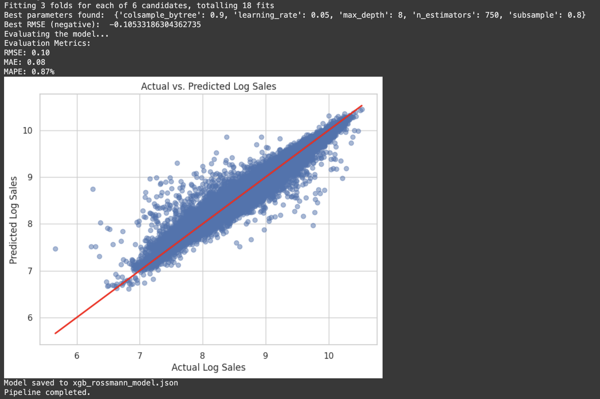
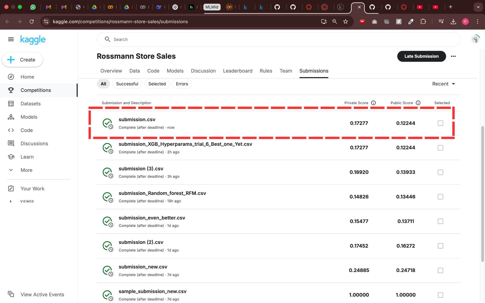

# Rossmann Store Sales Forecasting

This repository contains the code, datasets, and models for forecasting daily sales for Rossmann stores. The project aims to provide accurate sales predictions to assist the CFO in budgeting for store renovations.

**Dataset Source**: [Rossmann Store Sales Dataset](https://www.kaggle.com/code/michaelpawlus/obligatory-xgboost-example/comments)

## Repository Structure

- **`best_models/`**: Contains notebooks for the best-performing XGBoost and Random Forest models.
- **`dataset/`**: Includes the dataset files used for training and testing.
- **`final_model/`**: Contains the final XGBoost model (Model 8) with training and testing scripts.
  - **`train.py`**: Script to train the model and evaluate it on a test set.
  - **`test.py`**: Script to generate predictions for the Kaggle test set.
  - **`model_weights/`**: Stores the trained model weights.
  - **`model_cache/`**: Contains intermediate files (e.g., `rfm_features.csv`, `reference_data.txt`) generated during training for use in testing.
  - **`results/`**: Stores output files:
    - `submission.csv`: Predictions generated by `test.py`.
    - `model_performance_metrics.png`: Visualization of model performance metrics.
    - `test_csv_final_score_on_kaggle.png`: Screenshot of final Kaggle score.
- **`research_notebooks/`**: Contains all notebooks for the models experimented with during the project.
- **`.gitignore`**: Specifies files and directories to be ignored by Git.

## Getting Started

### Prerequisites

- Python 3.8+
- Required Python packages: `pandas`, `numpy`, `scikit-learn`, `xgboost`, `matplotlib`, `seaborn`

### Installation

1. Clone the repository:

   ```bash
   git clone https://github.com/yourusername/rossmann-store-sales.git
   cd rossmann-store-sales
   ```

2. Install the required packages:

   ```bash
   pip install -r requirements.txt
   ```

## Usage

### Training the Model

1. Navigate to the `final_model` directory:

   ```bash
   cd final_model
   ```

2. Run the training script:

   ```bash
   python train.py
   ```

   This script will:

   - Split the data into training and testing sets.
   - Train the XGBoost model.
   - Evaluate the model on the test set using RMSE, MAE, and MAPE.
   - Save the model weights and intermediate files in `model_weights/` and `model_cache/`.

### Testing the Model

After training, run the testing script:

```bash
python test.py
```

This script will:

- Load the trained model and intermediate files.
- Generate predictions for the Kaggle test set.
- Save the predictions as `submission.csv` in the `results/` folder.

### Kaggle Submission

Upload the `submission.csv` file to the Kaggle competition to evaluate the model's performance.

## Model Experimentation

| Model                   | Description                                                        | RMSE  | Train Time |
|------------------------|--------------------------------------------------------------------|-------|------------|
| 1. Linear Regression    | Baseline model without feature engineering or hyperparameter tuning.| 0.35  | ~35 mins   |
| 2. XGBoost (Basic)      | Basic feature engineering, standard hyperparameters.               | 0.24  | ~23 mins   |
| 3. XGBoost (Overfit)    | Excessive feature engineering, increased hyperparameters.          | 0.27  | ~28 mins   |
| 4. XGBoost (RFM)        | RFM feature engineering, optimized hyperparameters.                | 0.16  | ~22 mins   |
| 5. Random Forest (RFM)  | RFM feature engineering, optimized hyperparameters.                | 0.137 | ~40 mins   |
| 6. Random Forest (Tuned)| RFM feature engineering, further hyperparameter tuning.            | 0.134 | ~45 mins   |
| 7. Random Forest (Final)| RFM feature engineering, alternative hyperparameters.              | 0.139 | ~40 mins   |
| 8. XGBoost (Final)      | RFM feature engineering, best hyperparameters.                     | 0.12  | ~24 mins   |

The final model chosen is **XGBoost (Model 8)** due to its balance of accuracy, speed, and scalability.

## Results

### Model Performance Metrics



- **RMSE**: 0.12
- **MAE**: 0.08
- **MAPE**: 0.87%

These metrics indicate high precision and reliability, making the model suitable for real-world deployment.

### Kaggle Score



## Future Work

- **Feature Engineering**: Incorporate external data (e.g., local events, weather) to explain anomalies like weekend sales dips.
- **Model Improvements**: Experiment with hybrid models (e.g., XGBoost + Prophet) for long-term trend decomposition.
- **Hyperparameter Tuning**: Optimize subsample and colsample_bytree to reduce overfitting.
